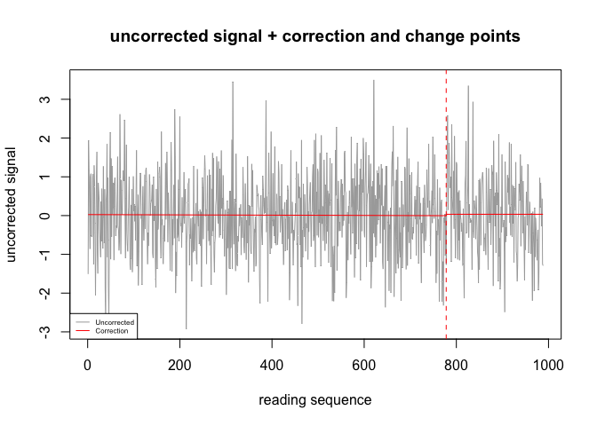
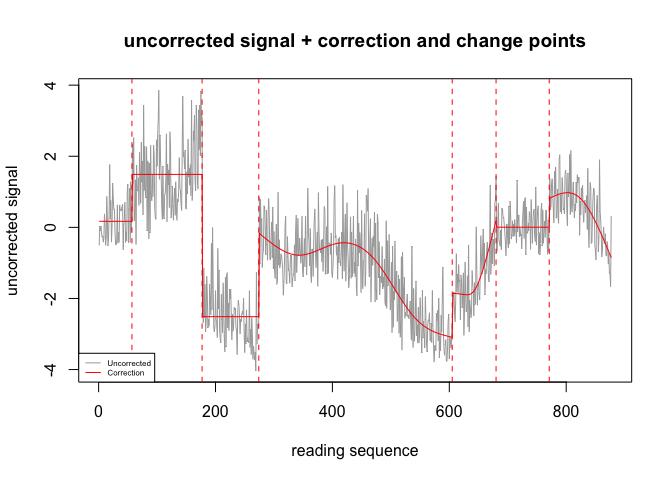

<!-- README.md is generated from README.Rmd. Please edit that file -->

# changomics

<!-- badges: start -->

<!-- badges: end -->

The goal of changomics is to correct a data set of metabolites that has been distorted during the data gathering. It detects automatically through dynamic programming the change points in time series and then residualize, detrend and normalize the time series of metabolites.

## Installation

You can install the development version of changomics from [GitHub](https://github.com/) with:

``` r
# install.packages("devtools")
devtools::install_github("antoinejeanrenaud/changomics")
```

## Example

This is a basic example which shows how to use the changomics function. This example allows to correct for the two metabolites in the data set met.df.

``` r
library(changomics)
# Load the data of metabolites
data(met.df)
# Use changomics to correct the metabolites
corrected<-changomics(as.data.frame(met.df),graph=FALSE)
```

There is a parameter "graph" which allow to plot the change points found in the data sequence and show how it is detrended. When set to TRUE it will produce a plot for the first metabolite of the data set to be corrected.

``` r
library(changomics)
# Load the data of metabolites
data(met.df)
# Use changomics to correct the metabolites
met1<-as.data.frame(met.df$met1)
corrected<-changomics(met1,graph=TRUE)
```



Here we have a metabolite that is not distorted, so the function changomics is not really correcting it. The algorithm has found a change point, but this can happen when there are outliers.

``` r
library(changomics)
# Load the data of metabolites
data(met.df)
# Use changomics to correct the metabolites
met2<-as.data.frame(met.df$met2)
corrected<-changomics(met2,graph=TRUE)
```



This time the signal was distorted and we see the change points estimated and the correction applied. Of course, the algorithm is probably not recovering each change point perfectly, but in the end the correlation with the original non distorted time series is the most important.
